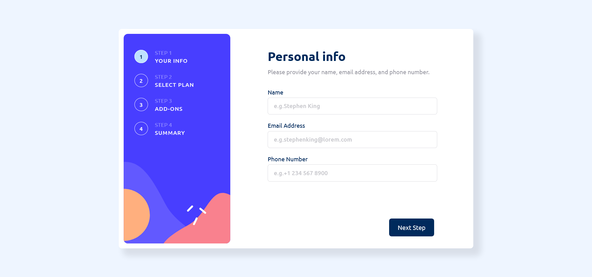
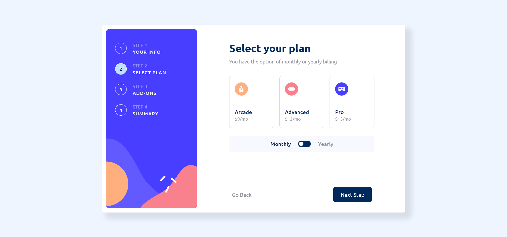
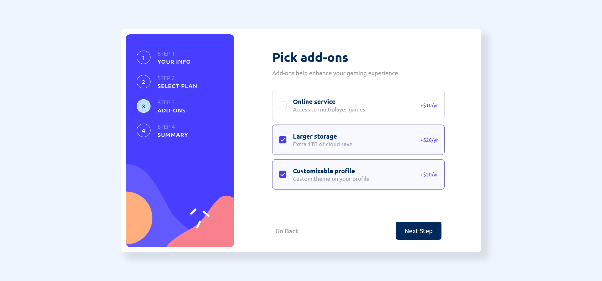
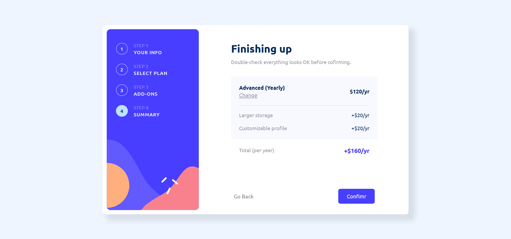
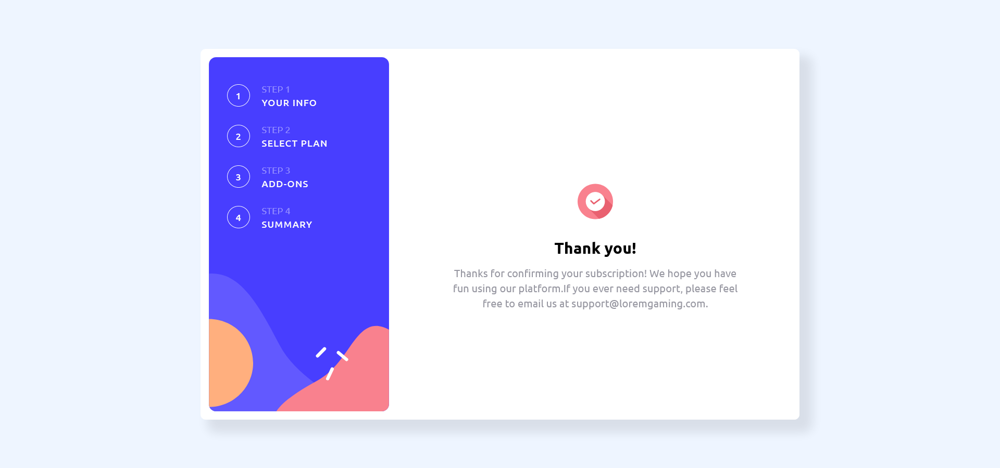

# Frontend Mentor - Multi-step form solution

This is a solution to the [Multi-step form challenge on Frontend Mentor](https://www.frontendmentor.io/challenges/multistep-form-YVAnSdqQBJ). Frontend Mentor challenges help you improve your coding skills by building realistic projects.

## Table of contents

- [Overview](#overview)
  - [The challenge](#the-challenge)
  - [Screenshot](#screenshot)
  - [Links](#links)
- [My process](#my-process)
  - [Built with](#built-with)
  - [What I learned](#what-i-learned)
  - [Continued development](#continued-development)
- [Author](#author)

## Overview

### The challenge

Users should be able to:

- Complete each step of the sequence
- Go back to a previous step to update their selections
- See a summary of their selections on the final step and confirm their order
- View the optimal layout for the interface depending on their device's screen size
- See hover and focus states for all interactive elements on the page
- Receive form validation messages if:
  - A field has been missed
  - The email address is not formatted correctly
  - A step is submitted, but no selection has been made

### Screenshot







### Links

- Solution URL: [https://github.com/lucasdef15/multi-step-form](https://github.com/lucasdef15/multi-step-form)
- Live Site URL: [https://bucolic-sunburst-e006de.netlify.app/](https://bucolic-sunburst-e006de.netlify.app/)

## My process

### Built with

- Semantic HTML5 markup
- CSS custom properties
- Flexbox
- CSS Grid
- Mobile-first workflow
- [React](https://reactjs.org/) - JS library
- [Redux](https://redux.js.org/) - State Manager
- [React Router v6.4](https://reactrouter.com/en/main) - Routing library
- [React Hook Form](https://react-hook-form.com/) - For forms structure
- [Yup](https://github.com/jquense/yup) - For form validation

### What I learned

While working on this project, I gained valuable experience using React hook form library and implementing validation using Yup. I found both libraries to be incredibly user-friendly and intuitive.

Below is an example of how I integrated these libraries into my code:

```jsx
const schema = Yup.object().shape({
  fullName: Yup.string()
    .required('This field is required')
    .matches(fullNameRegExp, 'Invalid name'),
  email: Yup.string().required('This field is required').email('Invalid email'),
  phoneNumber: Yup.string()
    .required('This field is required')
    .matches(phoneRegExp, 'Invalid phone number'),
});
```

### Continued development

In the future, I plan to rebuild this app using styled components and a CSS library such as Material UI or Tailwind CSS. I found that styling the app was time-consuming, and I believe that using styled components will significantly reduce the time and effort required for styling.


## Author

- Website - [Lucas Faria](https://lucasffaria.netlify.app/)
- Frontend Mentor - [@lucasdef15](https://www.frontendmentor.io/profile/lucasdef15)
- Linkedin - [@Lucas_Faria](https://www.linkedin.com/in/lucas-f-16b2b3113/)

